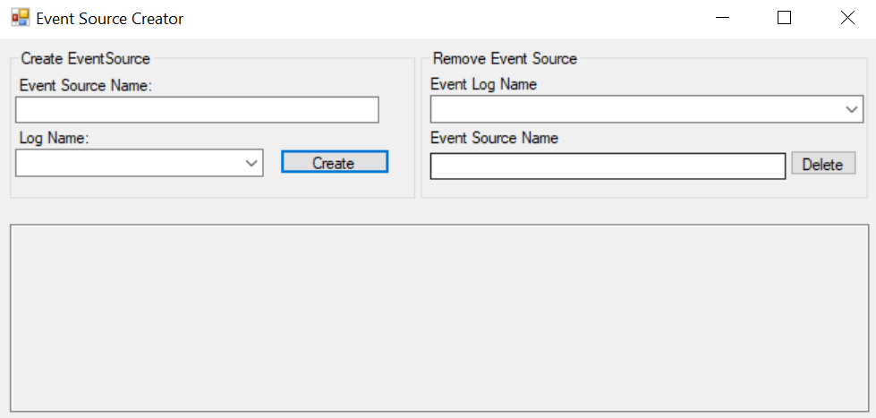

# EventSourceCreator

A small C# Form Application to make it easier to create Event Sources and delete those.

## Requierments
Code was written in .NET 4.6.2
Need Administrator privileges

## Usage 
Just extract and run the EventSourceCreator.exe

